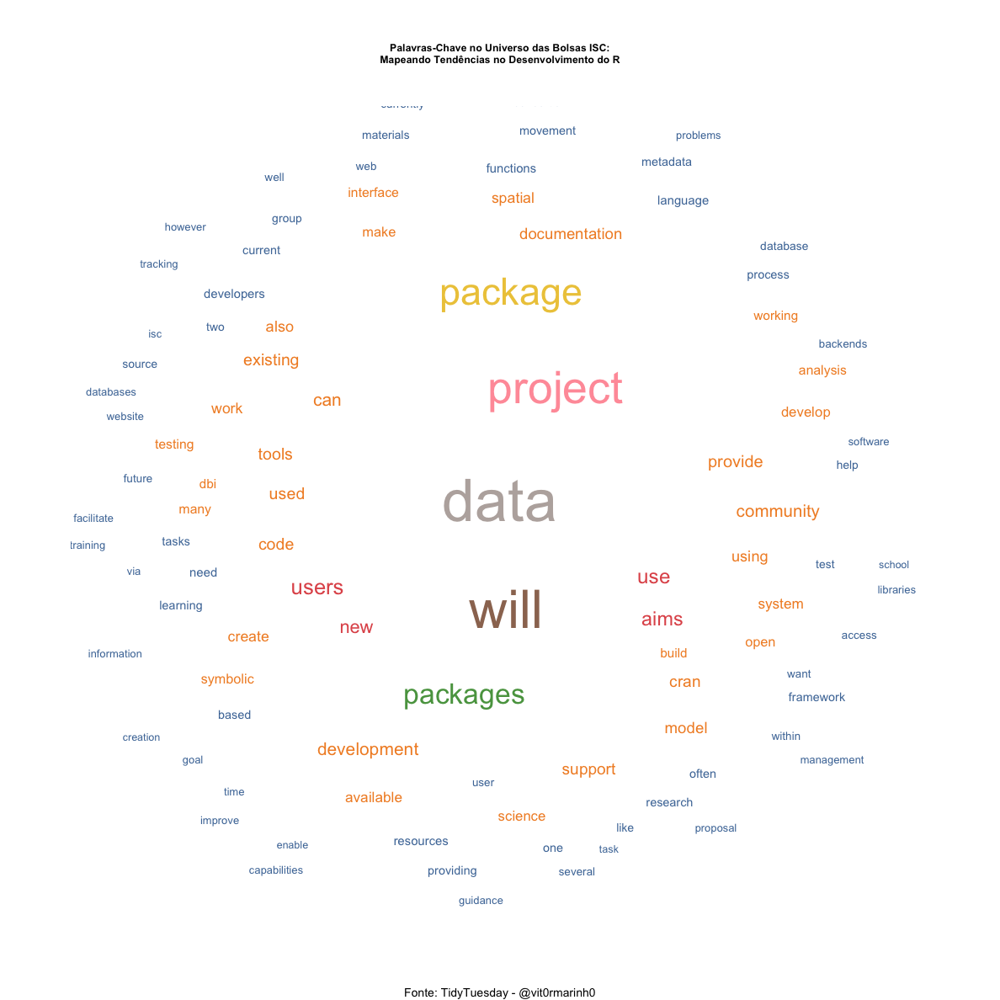

# TidyTuesday Gráficos

Este repositório contém uma coleção dos meus gráficos criados para o desafio semanal #TidyTuesday. Cada pasta representa um gráfico diferente, correspondendo a uma semana específica do desafio.

## 2024

#### [Semana 9](semana_9/)
#### [Link para grafico interativo]([semana_9](https://vitor-marinho-fjp.github.io/tidy_tuesday/)/)

#### [Semana 8](week_8/)

<!-- Repita o formato acima para outras semanas e outros gráficos -->

